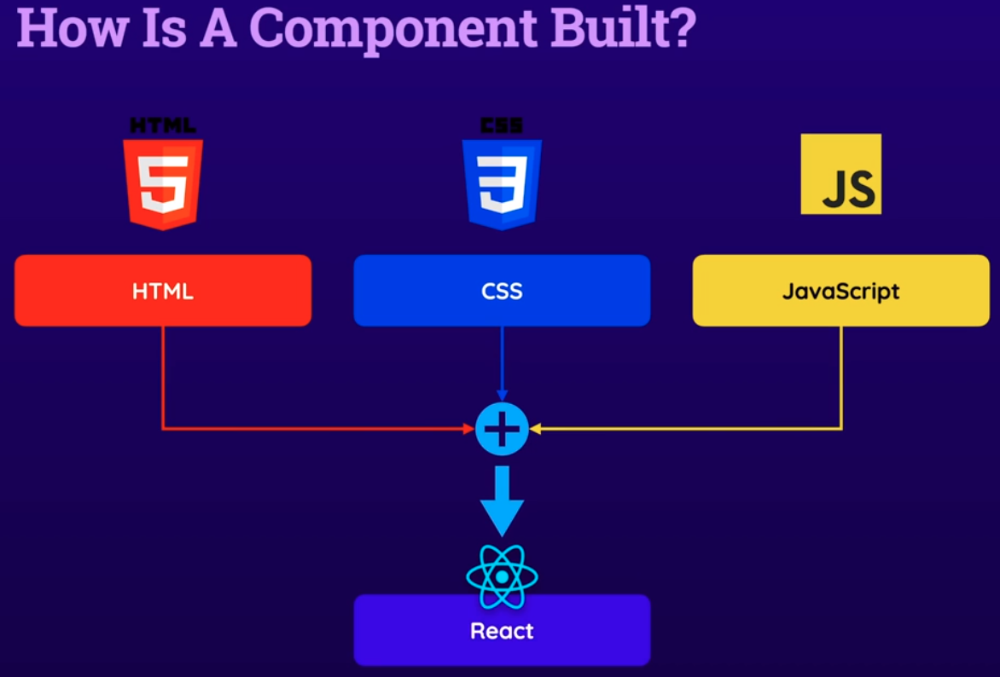
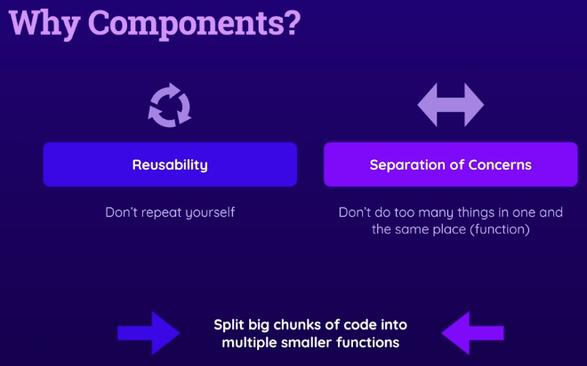
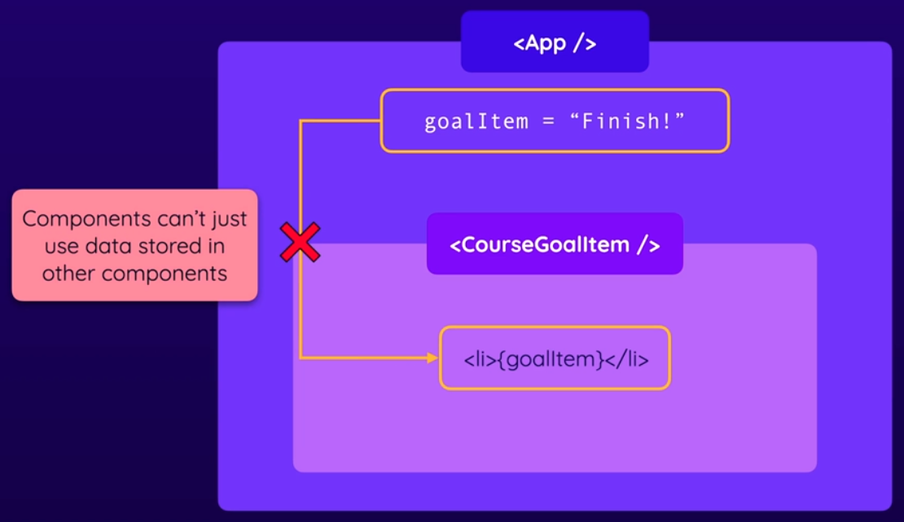
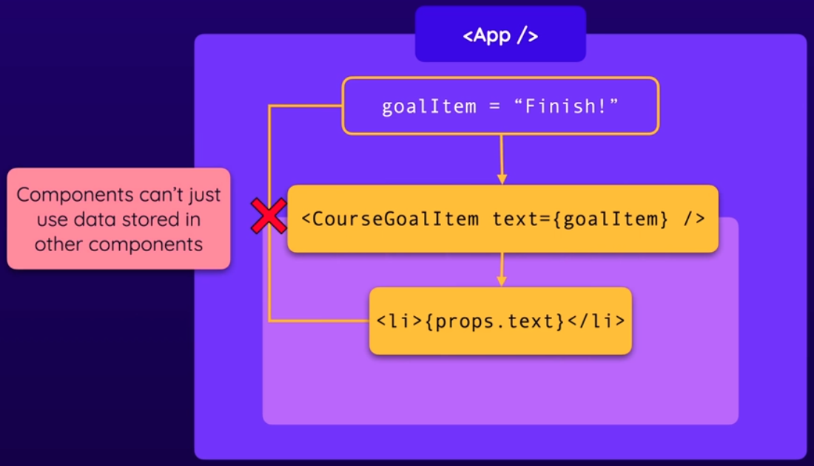
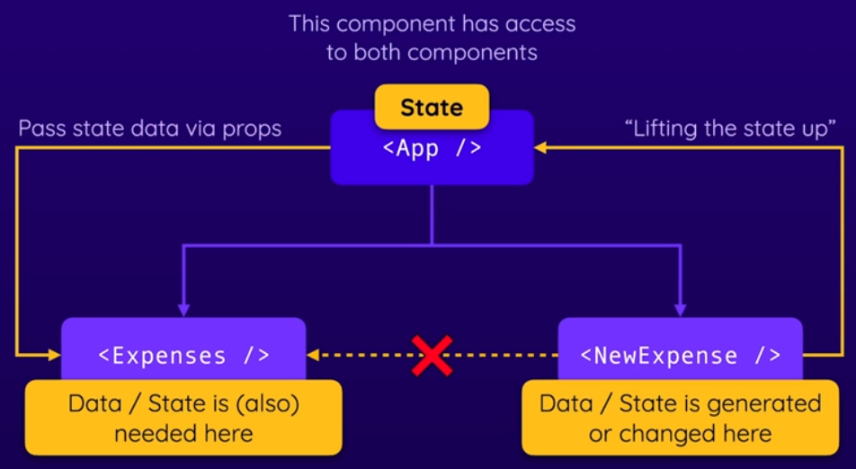

# React Basics & Working With Components

## What are component?

- React is a Javascript library for building user interfaces.
- React makes building complex interactive and reactive user interfaces simpler.
- React is all about Components.
- Components are reusable building blocks in the user interface.



- Components are a combination of HTML code, CSS code for styling and Javascript code for logic.



## React code is written in a Declarative Way

- React uses a declarative approach for building the components.
- **Declarative Approach:** Define the desired target state(s) and let React figure out the actual Javascript DOM instructions.
- Create a react app -

```text
npx create-react-app my-app
cd my-app
npm install
```

- `index.js` is the first file to execute.
- JSX means JavaScript XML.
- A component in React is just a Javascript function which returns JSX code.
- **Component Convention:** Function name will be the file name.
- **Component Creation Convention:** All the components are kept in the `components/` directory under the `src/` directory.

```text
src/
  components/
    ExpenseItem.js
  App.js
  index.js
```

- `ExpenseItem.js` file -

```js
const ExpenseItem = () => {
  return <h2>Expense item</h2>
}

export default ExpenseItem
```

- `App.js` file -

```js
import ExpenseItem from './components/ExpenseItem'

function App() {
  return (
    <div>
      <h2>Let's get started!</h2>
      <ExpenseItem></ExpenseItem>
    </div>
  )
}

export default App
```

- **CSS Convention:** `ExpenseItem.css` will be the filename of `ExpenseItem.js` file and the file should be contained in the `components/` directory.

```text
src/
  components/
    ExpenseItem.js
    ExpenseItem.css
  App.js
  Index.js
```

- Importing css file in the `ExpenseItem.js` file -

```js
import './ExpenseItem.css'

const ExpenseItem = () => {
  return (
    <div className='expense-item'>
      <div>March 28th 2021</div>
      <div className='expense-item__description'>
        <h2>Car Insurance</h2>
        <div className='expense-item__price'>$294.67</div>
      </div>
    </div>
  )
}

export default ExpenseItem
```

## Dynamic Data in the Component

- Dynamic Data showing inside the component -

```js
import './ExpenseItem.css'

const ExpenseItem = () => {
  const expenseDate = new Date(2021, 2, 28)
  const expenseTitle = 'Car Insurance'
  const expenseAmount = 294.67

  return (
    <div className='expense-item'>
      <div>{expenseDate.toISOString()}</div>
      <div className='expense-item__description'>
        <h2>{expenseTitle}</h2>
        <div className='expense-item__price'>${expenseAmount}</div>
      </div>
    </div>
  )
}

export default ExpenseItem
```

## Passing Data via `props`

- Props are the attributes of my 'Custom HTML elements' (Components).
- Example of Passing Data via `Props` -



- I can pass data to the custom component by adding an attribute.
- Inside that component, I can get access to all these attributes which might have been set on my custom component.
- This is called `props` instead of attributes which stands for properties.



- `props` is an object which holds all the received attributes as properties like key-value manner.

- So, making my component reusable and configurable by using the `props` concept.

- `App.js` file (passing static date from `App` component to `ExpenseItem` component) -

```js
function App() {
  return (
    <div>
      <h2>Let's get started!</h2>
      <ExpenseItem
        title='Toilet Paper'
        amount='94.12'
        date={new Date(2020, 7, 14)}
      ></ExpenseItem>
    </div>
  )
}

export default App
```

- `ExpenseItem.js` file -

```js
import './ExpenseItem.css'

const ExpenseItem = (props) => {
  return (
    <div className='expense-item'>
      <div>{props.date.toISOString()}</div>
      <div className='expense-item__description'>
        <h2>{props.title}</h2>
        <div className='expense-item__price'>${props.amount}</div>
      </div>
    </div>
  )
}

export default ExpenseItem
```

- But I can pass dynamic date from `App` component to `ExpenseItem` component -

```js
import ExpenseItem from './components/ExpenseItem'

function App() {
  const expenses = [
    {
      id: 'e1',
      title: 'Toilet Paper',
      amount: 94.12,
      date: new Date(2020, 7, 14),
    },
    { id: 'e2', title: 'New TV', amount: 799.49, date: new Date(2021, 2, 12) },
  ]

  return (
    <div>
      <h2>Let's get started!</h2>
      <ExpenseItem
        title={expenses[0].title}
        amount={expenses[0].amount}
        date={expenses[0].job}
      ></ExpenseItem>
    </div>
  )
}

export default App
```

- I am destructuring the `props` object while taking as a parameter -

```js
import './ExpenseItem.css'

const ExpenseItem = ({ title, amount, date }) => {
  return (
    <div className='expense-item'>
      <div>{date.toISOString()}</div>
      <div className='expense-item__description'>
        <h2>{title}</h2>
        <div className='expense-item__price'>${amount}</div>
      </div>
    </div>
  )
}

export default ExpenseItem
```

## Alternative Ways of Passing & Receiving / Handling `props`

- **Method 01:** `App.js` file, passing single `props` like `<ExpenseItem expense={expenses[0]}></ExpenseItem>` -

```js
import ExpenseItem from './components/ExpenseItem'

function App() {
  const expenses = [
    {
      id: 'e1',
      title: 'Toilet Paper',
      amount: 94.12,
      date: new Date(2020, 7, 14),
    },
    { id: 'e2', title: 'New TV', amount: 799.49, date: new Date(2021, 2, 12) },
  ]

  return (
    <div>
      <h2>Let's get started!</h2>
      <ExpenseItem expense={expenses[0]}></ExpenseItem>
    </div>
  )
}

export default App
```

- `ExpenseItem.js` file -

```js
import './ExpenseItem.css'

const ExpenseItem = (props) => {
  return (
    <div className='expense-item'>
      <div>{props.expense.date.toISOString()}</div>
      <div className='expense-item__description'>
        <h2>{props.expense.title}</h2>
        <div className='expense-item__price'>${props.expense.amount}</div>
      </div>
    </div>
  )
}

export default ExpenseItem
```

- I can destructure the object like:

```js
const ExpenseItem = (props) => {
  const { title, date, amount } = props.expense

  return (
    <div className='expense-item'>
      <div>{date.toISOString()}</div>
      <div className='expense-item__description'>
        <h2>{title}</h2>
        <div className='expense-item__price'>${amount}</div>
      </div>
    </div>
  )
}
```

- If I pass `props` in `App.js` -

```js
function App() {
  return (
    <div>
      <ExpenseItem
        title={expenses[0].title}
        amount={expenses[0].amount}
        date={expenses[0].job}
      ></ExpenseItem>
    </div>
  )
}
```

- then,

```js
const ExpenseItem = ({ title, date, amount }) => {
  return (
    <div className='expense-item'>
      <div>{date.toISOString()}</div>
      <div className='expense-item__description'>
        <h2>{title}</h2>
        <div className='expense-item__price'>${amount}</div>
      </div>
    </div>
  )
}
```

- **Method: 02** `App.js` file, passing `props` like `<ExpenseItem {...expenses[0]}></ExpenseItem>`

```js
import ExpenseItem from './components/ExpenseItem'

function App() {
  const expenses = [
    {
      id: 'e1',
      title: 'Toilet Paper',
      amount: 94.12,
      date: new Date(2020, 7, 14),
    },
    { id: 'e2', title: 'New TV', amount: 799.49, date: new Date(2021, 2, 12) },
  ]

  return (
    <div>
      <h2>Let's get started!</h2>
      <ExpenseItem {...expenses[0]}></ExpenseItem>
      <ExpenseItem {...expenses[1]}></ExpenseItem>
    </div>
  )
}

export default App
```

- `ExpenseItem.js` file -

```js
import './ExpenseItem.css'

const ExpenseItem = ({ title, date, amount }) => {
  const month = date.toLocaleString('en-Us', { month: 'long' })
  const day = date.toLocaleString('en-Us', { day: '2-digit' })
  const year = date.getFullYear()

  return (
    <div className='expense-item'>
      <div>
        <div>{month}</div>
        <div>{year}</div>
        <div>{day}</div>
      </div>
      <div className='expense-item__description'>
        <h2>{title}</h2>
        <div className='expense-item__price'>${amount}</div>
      </div>
    </div>
  )
}

export default ExpenseItem
```

## Split Components into Multiple Components

- Good practice is keeping created multiple components
- Create as little component as possible


- I can use a component like `<ExpenseItem></ExpenseItem>` or `<ExpenseItem/>`
- The file structure -

```text
src/
  components/
    ExpenseItem.js
    ExpenseItem.css
    ExpenseDate.js
    ExpenseDate.css
  App.js
  Index.js
```

- In `App.js` file -

```js
import NewExpense from './components/NewExpense/NewExpense'
import Expenses from './components/Expenses/Expenses'

function App() {
  const expenses = [
    {
      id: 'e1',
      title: 'Toilet Paper',
      amount: 94.12,
      date: new Date(2020, 7, 14),
    },
    { id: 'e2', title: 'New TV', amount: 799.49, date: new Date(2021, 2, 12) },
  ]

  return (
    <div>
      <Expenses items={expenses} />
    </div>
  )
}

export default App
```

- In `Expense.js` file -

```js
import ExpenseItem from './ExpenseItem'
import './Expenses.css'

const Expenses = (props) => {
  return (
    <div className='expenses'>
      <ExpenseItem
        title={props.items[0].title}
        amount={props.items[0].amount}
        date={props.items[0].date}
      />
      <ExpenseItem
        title={props.items[1].title}
        amount={props.items[1].amount}
        date={props.items[1].date}
      />
      <ExpenseItem
        title={props.items[2].title}
        amount={props.items[2].amount}
        date={props.items[2].date}
      />
    </div>
  )
}

export default Expenses
```

- In `ExpenseItem.js` file -

```js
import ExpenseDate from './ExpenseDate'
import './ExpenseItem.css'

const ExpenseItem = ({ title, amount, date }) => {
  return (
    <div className='expense-item'>
      <ExpenseDate date={date} />
      <div className='expense-item__description'>
        <h2>{title}</h2>
        <div className='expense-item__price'>${amount}</div>
      </div>
    </div>
  )
}

export default ExpenseItem
```

- In `ExpenseDate.js` file -

```js
import './ExpenseDate.css'

const ExpenseDate = ({ date }) => {
  const month = date.toLocaleString('en-US', { month: 'long' })
  const day = date.toLocaleString('en-US', { day: '2-digit' })
  const year = date.getFullYear()

  return (
    <div className='expense-date'>
      <div className='expense-date__month'>{month}</div>
      <div className='expense-date__year'>{year}</div>
      <div className='expense-date__day'>{day}</div>
    </div>
  )
}

export default ExpenseDate
```

## The Concept of 'Composition' (`children` props)

- **Component composition:** building complex user interfaces by combining and nesting smaller, reusable components together.
- this approach allows developers to create modular, maintainable and scalable code.
- Each component focuses on a specific functionality or view and they can be composed together to form the complete UI.

- In `Expenses.js` file -

```js
import ExpenseItem from './ExpenseItem'
import './Expenses.css'
import Card from '../UI/Card'

const Expenses = (props) => {
  return (
    <Card className='expenses'>
      <ExpenseItem
        title={props.items[0].title}
        amount={props.items[0].amount}
        date={props.items[0].date}
      />
      <ExpenseItem
        title={props.items[1].title}
        amount={props.items[1].amount}
        date={props.items[1].date}
      />
      <ExpenseItem
        title={props.items[2].title}
        amount={props.items[2].amount}
        date={props.items[2].date}
      />
    </Card>
  )
}

export default Expenses
```

- In `Card.js` file -

```js
import './Card.css'

const Card = (props) => {
  const classes = 'card ' + props.className
  return <div className={classes}>{props.children}</div>
}

export default Card
```

- Note: A `children` is a special props which every component receives.
- Inside opening and closing component, everything is called `children`.

```js
<Card>...everthing inside that is called children</Card>
```

## A Closer Look At JSX

- An alternate way to write JSX code (but not recommended)

```js
import React from 'react'
import ExpenseItem from './components/ExpenseItem'

function App() {
  const expenses = [
    {
      id: 'e1',
      title: 'Toilet Paper',
      amount: 94.12,
      date: new Date(2020, 7, 14),
    },
    { id: 'e2', title: 'New TV', amount: 799.49, date: new Date(2021, 2, 12) },
  ]

  return React.createElement(
    'div',
    {},
    React.createElement('h2', {}, "Let's get started"),
    React.createElement(Expenses, { items: expenses })
  )
}

export default App
```

- Recommended way:

```js
import ExpenseItem from './components/ExpenseItem'

function App() {
  const expenses = [
    {
      id: 'e1',
      title: 'Toilet Paper',
      amount: 94.12,
      date: new Date(2020, 7, 14),
    },
    { id: 'e2', title: 'New TV', amount: 799.49, date: new Date(2021, 2, 12) },
  ]

  return (
    <div>
      <h2>Let's get started!</h2>
      <Expenses items={expenses}></Expenses>
    </div>
  )
}

export default App
```

# React State & Working with Events

## Listening to Events & Working with Event Handlers

- React exposes all these default events as props which start with `on`.
- Inside the `onClick` event, I just point.

```js
<button onClick={clickHandler}>Change Title</button>
```

- Not executed (not recommended)

```js
// Don't do that
<button onClick={clickHandler()}>Change Title</button>
```

- In `ExpenseItem.js` file -

```js
import ExpenseDate from './ExpenseDate'
import './ExpenseItem.css'
import Card from '../UI/Card'

const ExpenseItem = (props) => {
  const { title, date, amount } = props.expense

  const clickHandler = () => {
    console.log('Clicked')
  }

  return (
    <Card className='expense-item'>
      <ExpenseDate date={date}></ExpenseDate>
      <div className='expense-item__description'>
        <h2>{title}</h2>
        <div className='expense-item__price'>${amount}</div>
      </div>
      <button onClick={clickHandler}>Change Title</button>
    </Card>
  )
}

export default ExpenseItem
```

## Working with `State`

- `useState` is a funciton provided by the React library
- Importing as a named import

```js
import { useState } from 'react'

const ExpenseItem = (props) => {
  const [value, setValue] = useState(0) // useState

  return <></>
}

export default ExpenseItem
```

- Whenever `state` is changed, the component function being called again
- This is the key difference to the regular variable
- `useState` is a React hook
- React hooks are recognized to see the word `use` at the beginning
- Hooks must only be called inside the React component
- `useState` wants a default state value
- `useState` returns an array
- First element of that is the variable itself
- Second element of that array is the updating function of that variable or first element
- that second element,
  - update the value of this variable
  - re-render the component as well
- The state is separated on a per component instance basis.
- `ExpenseItem.js` file:

```js
import ExpenseDate from './ExpenseDate'
import './ExpenseItem.css'
import Card from '../UI/Card'
import { useState } from 'react'

const ExpenseItem = (props) => {
  const { title, date, amount } = props.expense

  const [myTitle, setMyTitle] = useState(title) // useState

  const clickHandler = () => {
    setMyTitle('Another title')
  }

  return (
    <Card className='expense-item'>
      <ExpenseDate date={date}></ExpenseDate>
      <div className='expense-item__description'>
        <h2>{myTitle}</h2>
        <div className='expense-item__price'>${amount}</div>
      </div>
      <button onClick={clickHandler}>Change Title</button>
    </Card>
  )
}

export default ExpenseItem
```

## Using One State Instead

- Instead of using multiple state like -

```js
export default ExpenseForm() => {
  const [enteredTitle, setEnteredTitle] = useState('')
  const [enteredAmount, setEnteredAmount] = useState('')
  const [enteredDate, setEnteredDate] = useState('')

  const titleChangeHandler = (event) => {
    // Update multiple state
    setEnteredTitle(event.target.value)
  }

  const amountChangeHandler = (event) => {
    setEnteredAmount(event.target.value)
  }

  const dateChangeHandler = (event) => {
    setEnteredDate(event.target.value)
  }

  return <></>
}
```

- For multiple state, I can use one single function instead of using multiple functions per state
- `ExpenseForm.js` file:

```js
import { useState } from 'react'
import './ExpenseForm.css'

const ExpenseForm = () => {
  const [enteredTitle, setEnteredTitle] = useState('')
  const [enteredAmount, setEnteredAmount] = useState('')
  const [enteredDate, setEnteredDate] = useState('')

  // For multiple state, I can use one single function instead of using multiple functions per state
  const inputChangeHandler = (identifier, value) => {
    if (identifier === 'title') {
      setEnteredTitle(value)
    } else if (identifier === 'amount') {
      setEnteredAmount(value)
    } else if (identifier === 'date') {
      setEnteredDate(value)
    }
  }

  return <></>
}

export default ExpenseForm
```

- And use this `inputChangeHandler` function like that -

```js
<div className='new-expense__control'>
  <label>Title</label>
  <input
    type='text'
    onChange={(event) => inputChangeHandler('title', event.target.value)}
  />
</div>
```

- If I write `inputChangeHandler('title', event.target.value)`, it will execute while the web page loading time.
- So, I need to execute like `(event) => inputChangeHandler('title', event.target.value)`

- **Use single state** -
- `ExpenseForm.js` file:

```js
export default ExpenseForm() => {
  const [userInput, setUserInput] = useState({
    enteredTitle: '',
    enteredAmount: '',
    enteredDate: '',
  })

  // 1. Copy the whole object
  // 2. Update the specific property
  const titleChangeHandler = (event) => {
    // Update single state
    setUserInput({ ...userInput, enteredTitle: event.target.value })
  }

  const amountChangeHandler = (event) => {
    setUserInput({ ...userInput, enteredAmount: event.target.value })
  }

  const dateChangeHandler = (event) => {
    setUserInput({ ...userInput, enteredDate: event.target.value })
  }

  return <></>
}
```

- Whenever I update state which depends on the previous state, it's recommended to use like the following -
- `ExpenseForm.js` file:

```js
export default ExpenseForm() => {
  const [userInput, setUserInput] = useState({
    enteredTitle: '',
    enteredAmount: '',
    enteredDate: '',
  })

  const titleChangeHandler = (event) => {
    // Recommended if there has a dependency of previous state
    setUserInput((prevState) => {
      return { ...prevState, enteredTitle: event.target.value }
    })
  }

  const amountChangeHandler = (event) => {
    setUserInput((prevState) => {
      return { ...prevState, enteredAmount: event.target.value }
    })
  }

  const dateChangeHandler = (event) => {
    setUserInput((prevState) => {
      return { ...prevState, enteredDate: event.target.value }
    })
  }

  return <></>
}
```

- Because React will ensure that `prevState` contains the latest update of `userInput` state
- That's why if I have a dependency of previous state, I need to use state like the previous style
- `useState` component flow -

1. render the component for the first time
2. set the initial value of the state variable using useState
3. while updating using set function of that state variable
   1. Update the state variable using set function, but I can't fetch imediately the updated state value
   2. Re-render the component (call component function again)
   3. While re-rendering, fetching the updated value of the state variable

- Form submit functionality -

```js
// Inside the component function
const submitHandler = (event) => {
  event.preventDefault()

  // Taking the variables and store into the other variables
  const expenseData = {
    title: enteredTitle,
    data: enteredDate,
    amount: enteredAmount,
  }
}
```

- Use that `submitHandler` funciton inside the form tag like -

```js
<form className='new-expense__controls' onSubmit={submitHandler}></form>
```

- **Two way binding:**
- First I have to clear the entered data from the states

```js
const submitHandler = (event) => {
  event.preventDefault()

  const expenseData = {
    title: enteredTitle,
    data: enteredDate,
    amount: enteredAmount,
  }

  console.log(expenseData)

  setEnteredTitle('')
  setEnteredAmount('')
  setEnteredDate('')
}
```

- Then I have to use the state value inside the `input` tag

```js
<input
  type='text'
  value={enteredTitle}
  onChange={(event) => inputChangeHandler('title', event.target.value)}
/>
```

- **Child-to-Parent Component communication:**
- Passing the function from one component (parent) to another component (child) using `props`
- `App.js` file:

```js
import NewExpense from './components/NewExpense/NewExpense'

function App() {
  const addExpenseHandler = (expense) => {
    console.log(expense)
  }

  return (
    <div>
      <NewExpense onAddExpense={addExpenseHandler} />
    </div>
  )
}

export default App
```

- Then use that function inside `NewExpense` component and pass to it's child component -
- `NewExpense.js` file:

```js
import ExpenseForm from './ExpenseForm'
import './NewExpense.css'

const NewExpense = (props) => {
  const saveExpenseDataHandler = (enteredExpenseData) => {
    const expenseData = {
      ...enteredExpenseData,
      id: Math.random().toString(),
    }

    // Use that received function
    props.onAddExpense(expenseData)
  }

  return (
    <div className='new-expense'>
      {/*  */}
      <ExpenseForm onSaveExpenseData={saveExpenseDataHandler} />
    </div>
  )
}

export default NewExpense
```

- After that, I pass `saveExpenseDataHandler` function as props.
- `ExpenseForm.js` file:

```js
import { useState } from 'react'
import './ExpenseForm.css'

const ExpenseForm = (props) => {
  const [enteredTitle, setEnteredTitle] = useState('')
  const [enteredAmount, setEnteredAmount] = useState('')
  const [enteredDate, setEnteredDate] = useState('')

  // For multiple state, I can use one single function instead of using multiple functions per state
  const inputChangeHandler = (identifier, value) => {
    if (identifier === 'title') {
      setEnteredTitle(value)
    } else if (identifier === 'amount') {
      setEnteredAmount(value)
    } else if (identifier === 'date') {
      setEnteredDate(value)
    }
  }

  const submitHandler = (event) => {
    event.preventDefault()

    const expenseData = {
      title: enteredTitle,
      data: enteredDate,
      amount: enteredAmount,
    }

    // Use here
    props.onSaveExpenseData(expenseData)

    setEnteredTitle('')
    setEnteredAmount('')
    setEnteredDate('')
  }

  return (
    <form className='new-expense__controls' onSubmit={submitHandler}>
      <div className='new-expense__control'>
        <label>Title</label>
        <input
          type='text'
          value={enteredTitle}
          onChange={(event) => inputChangeHandler('title', event.target.value)}
        />
      </div>
      <div className='new-expense__control'>
        <label htmlFor=''>Amount</label>
        <input
          type='number'
          min='0.01'
          step='0.01'
          value={enteredAmount}
          onChange={(event) => inputChangeHandler('amount', event.target.value)}
        />
      </div>
      <div className='new-expense__control'>
        <label htmlFor=''>Date</label>
        <input
          type='date'
          min='2018-01-01'
          max='2022-12-31'
          value={enteredDate}
          onChange={(event) => inputChangeHandler('date', event.target.value)}
        />
      </div>
      <div className='new-expense__actions'>
        <button type='submit'>Add Expense</button>
      </div>
    </form>
  )
}

export default ExpenseForm
```

- Method 02:
- I pass `addExpenseHandler` function from `App` component to `ExpenseForm` via `NewExpense` component
- `App.js` file:

```js
import NewExpense from './components/NewExpense/NewExpense'

function App() {
  const addExpenseHandler = (expense) => {
    console.log(expense)
  }

  return (
    <div>
      <NewExpense onAddExpense={addExpenseHandler} />
    </div>
  )
}

export default App
```

- `NewExpense.js` file:

```js
import ExpenseForm from './ExpenseForm'
import './NewExpense.css'

const NewExpense = (props) => {
  return (
    <div className='new-expense'>
      <ExpenseForm onSaveExpenseData={props.onAddExpense} />
    </div>
  )
}

export default NewExpense
```

- `ExpenseForm.js` file:

```js
import { useState } from 'react'
import './ExpenseForm.css'

const ExpenseForm = (props) => {
  const [enteredTitle, setEnteredTitle] = useState('')
  const [enteredAmount, setEnteredAmount] = useState('')
  const [enteredDate, setEnteredDate] = useState('')

  const inputChangeHandler = (identifier, value) => {
    if (identifier === 'title') {
      setEnteredTitle(value)
    } else if (identifier === 'amount') {
      setEnteredAmount(value)
    } else if (identifier === 'date') {
      setEnteredDate(value)
    }
  }

  const submitHandler = (event) => {
    event.preventDefault()

    const expenseData = {
      title: enteredTitle,
      data: enteredDate,
      amount: enteredAmount,
    }

    // Use here
    props.onSaveExpenseData(expenseData)

    setEnteredTitle('')
    setEnteredAmount('')
    setEnteredDate('')
  }

  return (
    <form className='new-expense__controls' onSubmit={submitHandler}>
      <div className='new-expense__control'>
        <label>Title</label>
        <input
          type='text'
          value={enteredTitle}
          onChange={(event) => inputChangeHandler('title', event.target.value)}
        />
      </div>
      <div className='new-expense__control'>
        <label htmlFor=''>Amount</label>
        <input
          type='number'
          min='0.01'
          step='0.01'
          value={enteredAmount}
          onChange={(event) => inputChangeHandler('amount', event.target.value)}
        />
      </div>
      <div className='new-expense__control'>
        <label htmlFor=''>Date</label>
        <input
          type='date'
          min='2018-01-01'
          max='2022-12-31'
          value={enteredDate}
          onChange={(event) => inputChangeHandler('date', event.target.value)}
        />
      </div>
      <div className='new-expense__actions'>
        <button type='submit'>Add Expense</button>
      </div>
    </form>
  )
}

export default ExpenseForm
```

- **Lifting The State Up**
- If I need to pass date or state from `NewExpense` to `Expense` component (between siblings components),I need this lifting the state up concept
- Because I don’t have any direct connection between two sibling components
- I know using props I can communicate from parent to child and vice versa
- Using that concept, I can lift the state up to the parent component (`NewExpense` -> `App`)
- Similarly, passing state date via `props` to child component (`App` -> `Expenses`)



- **Derived / Computed State**
- If possible, instead of using state value, I can use derived or computed State which depends of state value or variable

```js
const Expenses = (props) => {
  const [filteredYear, setFilteredYear] = useState('2020')

  let filterIntoText = '2019, 2021 & 2022'

  if (filteredYear === '2019') {
    filterIntoText = '2020, 2021 & 2022'
  } else if (filteredYear === '2020') {
    filterIntoText = '2019, 2021 & 2022'
  } else if (filteredYear === '2021') {
    filterIntoText = '2019, 2020 & 2022'
  } else {
    filterIntoText = '2019, 2020 & 2021'
  }

  return <></>
}

export default Expenses
```

- **Controlled Component** have their state and behavior controlled by the parent component.
- These components rely on props passed down from the parent component to update their state and behavior
- `App.js` file -

```js
const App = () => {
  const [value, setValue] = React.useState(0)

  return <Expense onSaveValue={setValue} />
}

export default App
```

- `Expense.js` file -

```js
const Expense = (props) => {
  // Controlled the behavior using props received from the parent component
  return <p>The value: {props.value}</p>
}

export default Expense
```

- **Uncontrolled Component** refer to components that manage their own state internally
- `Expense.js` file -

```js
const Expense = () => {
  const [value, setValue] = React.useState(0)

  // Controlled the behavior using its own state
  const clickHandler = () => {
    setValue((prevState) => {
      return prevState + 1
    })
  }

  return (
    <>
      <p>The value: {value}</p>
      <button onclick={clickHandler}></button>
    </>
  )
}

export default Expense
```

- **Statefull Component** have internal state
- `Expense.js` file -

```js
const Expense = () => {
  const [value, setValue] = React.useState(0)

  // Contain its own state
  const clickHandler = () => {
    setValue((prevState) => {
      return prevState + 1
    })
  }

  return (
    <>
      <p>The value: {value}</p>
      <button onclick={clickHandler}></button>
    </>
  )
}

export default Expense
```

- **Stateless Component** have no internal state
- `Expense.js` file -

```js
const Expense = () => {
  return <div>Hello World</div>
}

export default Expense
```

- **Rendering Lists of Data**
- Instead of calling one by one component, I can call using `map` function
- In `Expenses.js` file -

```js
import { useState } from 'react'

import ExpenseItem from './ExpenseItem'
import Card from '../UI/Card'
import ExpensesFilter from './ExpensesFilter'
import './Expenses.css'

const Expenses = (props) => {
  const [filteredYear, setFilteredYear] = useState('2020')

  const filterChangeHandler = (selectedYear) => {
    setFilteredYear(selectedYear)
  }

  return (
    <div>
      <Card className='expenses'>
        <ExpensesFilter
          selected={filteredYear}
          onChangeFilter={filterChangeHandler}
        />

        {props.items.map((expense) => (
          <ExpenseItem
            title={expense.title}
            amount={expense.amount}
            date={expense.date}
          />
        ))}
      </Card>
    </div>
  )
}

export default Expenses
```

- **Using Stateful Lists**
- Use a react state to manage the array
- Update if anything is added
- In `App.js` -

```js
import { useState } from 'react'

import NewExpense from './components/NewExpense/NewExpense'
import Expenses from './components/Expenses/Expenses'

const DUMMY_EXPENSES = [
  {
    id: 'e1',
    title: 'Toilet Paper',
    amount: 94.12,
    date: new Date(2020, 7, 14),
  },
  { id: 'e2', title: 'New TV', amount: 799.49, date: new Date(2021, 2, 12) },
  {
    id: 'e3',
    title: 'Car Insurance',
    amount: 294.67,
    date: new Date(2021, 2, 28),
  },
  {
    id: 'e4',
    title: 'New Desk (Wooden)',
    amount: 450,
    date: new Date(2021, 5, 12),
  },
]

const App = () => {
  const [expenses, setExpenses] = useState(DUMMY_EXPENSES)

  const addExpenseHandler = (expense) => {
    // Because it depends on the previous state
    setExpenses((prevExpenses) => {
      // First, copy the added item, then copy all the contents
      return [expense, ...prevExpenses]
    })
  }

  return (
    <div>
      <NewExpense onAddExpense={addExpenseHandler} />
      <Expenses items={expenses} />
    </div>
  )
}

export default App
```

- **Understanding 'keys'**
- Adding a new item, React renders this new item as the last item in the list
- Update all items and replace their contents

- **Drowbacks:**
- It creates performance issue because of visiting all the items and updated
- It leads bugs

- **Workaround:**
- Making every list of the item unique
- So that, adding a key while mapping the component (list of items)
- In `Expenses.js` file -

```js
{
  props.items.map((expense) => (
    <ExpenseItem
      key={expense.id}
      title={expense.title}
      amount={expense.amount}
      date={expense.date}
    />
  ))
}
```

- **Filtered the list**
- I can filter the list like `Expenses.js` file -

```js
import { useState } from 'react'

import ExpenseItem from './ExpenseItem'
import Card from '../UI/Card'
import ExpensesFilter from './ExpensesFilter'
import './Expenses.css'

const Expenses = (props) => {
  const [filteredYear, setFilteredYear] = useState('2020')

  const filterChangeHandler = (selectedYear) => {
    setFilteredYear(selectedYear)
  }

  // Return an array based on condition
  const filteredExpenses = props.items.filter(
    (expense) => expense.date.getFullYear().toString() === filteredYear
  )

  return (
    <div>
      <Card className='expenses'>
        <ExpensesFilter
          selected={filteredYear}
          onChangeFilter={filterChangeHandler}
        />
        {filteredExpenses.map((expense) => (
          <ExpenseItem
            key={expense.id}
            title={expense.title}
            amount={expense.amount}
            date={expense.date}
          />
        ))}
      </Card>
    </div>
  )
}

export default Expenses
```

- **Ternary Operator**
- In `Expenses.js` file -

```js
import { useState } from 'react'

import ExpenseItem from './ExpenseItem'
import Card from '../UI/Card'
import ExpensesFilter from './ExpensesFilter'
import './Expenses.css'

const Expenses = (props) => {
  const [filteredYear, setFilteredYear] = useState('2020')

  const filterChangeHandler = (selectedYear) => {
    setFilteredYear(selectedYear)
  }

  const filteredExpenses = props.items.filter(
    (expense) => expense.date.getFullYear().toString() === filteredYear
  )

  return (
    <div>
      <Card className='expenses'>
        <ExpensesFilter
          selected={filteredYear}
          onChangeFilter={filterChangeHandler}
        />
        {filteredExpenses.length === 0 ? (
          <p>No expenses</p>
        ) : (
          filteredExpenses.map((expense) => (
            <ExpenseItem
              key={expense.id}
              title={expense.title}
              amount={expense.amount}
              date={expense.date}
            />
          ))
        )}
      </Card>
    </div>
  )
}

export default Expenses
```

- **Conditional Content**
- For `&&`, if `true`, then execute
- For `||`, if `false`, then execute
- In `Expenses.js` file -

```js
import { useState } from 'react'

import ExpenseItem from './ExpenseItem'
import Card from '../UI/Card'
import ExpensesFilter from './ExpensesFilter'
import './Expenses.css'

const Expenses = (props) => {
  const [filteredYear, setFilteredYear] = useState('2020')

  const filterChangeHandler = (selectedYear) => {
    setFilteredYear(selectedYear)
  }

  const filteredExpenses = props.items.filter(
    (expense) => expense.date.getFullYear().toString() === filteredYear
  )

  return (
    <div>
      <Card className='expenses'>
        <ExpensesFilter
          selected={filteredYear}
          onChangeFilter={filterChangeHandler}
        />
        {filteredExpenses.length === 0 && <p>No expenses found.</p>}
        {filteredExpenses.length > 0 &&
          filteredExpenses.map((expense) => (
            <ExpenseItem
              key={expense.id}
              title={expense.title}
              amount={expense.amount}
              date={expense.date}
            />
          ))}
      </Card>
    </div>
  )
}

export default Expenses
```

- In `Expenses.js` file (recommended way) -

```js
import { useState } from 'react'

import ExpenseItem from './ExpenseItem'
import Card from '../UI/Card'
import ExpensesFilter from './ExpensesFilter'
import './Expenses.css'

const Expenses = (props) => {
  const [filteredYear, setFilteredYear] = useState('2020')

  const filterChangeHandler = (selectedYear) => {
    setFilteredYear(selectedYear)
  }

  const filteredExpenses = props.items.filter(
    (expense) => expense.date.getFullYear().toString() === filteredYear
  )

  // Recommended way - more clearer way
  let expenseContent = <p>No expenses found.</p>
  if (filteredExpenses.length > 0) {
    expenseContent = filteredExpenses.map((expense) => (
      <ExpenseItem
        key={expense.id}
        title={expense.title}
        amount={expense.amount}
        date={expense.date}
      />
    ))
  }

  return (
    <div>
      <Card className='expenses'>
        <ExpensesFilter
          selected={filteredYear}
          onChangeFilter={filterChangeHandler}
        />
        
        {expenseContent}
      </Card>
    </div>
  )
}

export default Expenses
```
